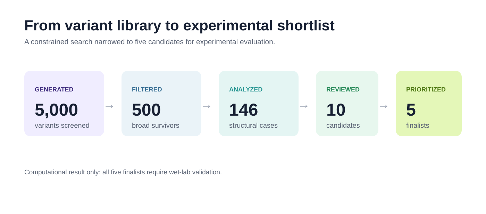

# Atlas

Atlas is a computational protein-engineering pipeline that uses structural and
stability evidence to prioritize mutation hypotheses for laboratory testing.
Its completed campaign screened 5,000 DP622-inspired metalloprotease variants
and selected five candidates for Aβ-related evaluation.

**These are computational predictions, not experimentally validated improvements
in Aβ cleavage.**

**Project status:** v1 campaign complete; wet-lab validation is outside the
scope of this repository.

## My role

I designed and implemented the pipeline architecture, constrained candidate
generation, evidence tracking, validation gates, finalist reporting, and the
reproducible GPU/Colab execution path.

## Result

The completed campaign executed this funnel:

The campaign narrowed 5,000 unique legal variants to 500 broad survivors, 146
structure-level analyses, 10 reviewed candidates, and five finalists.

| Candidate | Mutations | Why it was selected |
| --- | --- | --- |
| [ATLAS-0215A1AE2C58FD57](results/gate3/dossiers/ATLAS-0215A1AE2C58FD57.md) | G65M/Q153M | Function-oriented change paired with distal support |
| [ATLAS-1FB316267B702519](results/gate3/dossiers/ATLAS-1FB316267B702519.md) | A16C/Q153C | Orthogonal-mechanism epistatic double |
| [ATLAS-2EB17A2E3DB7062E](results/gate3/dossiers/ATLAS-2EB17A2E3DB7062E.md) | A130L | Conservative distal-stability explorer |
| [ATLAS-39F921440EC002E5](results/gate3/dossiers/ATLAS-39F921440EC002E5.md) | E104V | Second-shell preorganization explorer |
| [ATLAS-66C6BB6CAA1C310A](results/gate3/dossiers/ATLAS-66C6BB6CAA1C310A.md) | A37Y | Substrate-interface explorer |

See the [finalist summary](results/gate3/FINALIST_SUMMARY.md) and [final design report](results/gate3/atlas_final_design_report.md) for the full result and supporting files.

## The problem

The project tackles a VITA-inspired design problem: optimize a metalloprotease
scaffold for Aβ-related cleavage while keeping structural plausibility, stability,
interface support, and developability visible. The result is a shortlist where
the reasoning and uncertainty behind each candidate can be reviewed.

Here, **Aβ** refers to amyloid beta, and **DP622** is the metalloprotease
scaffold used as the design target. An **active-like reconstruction** is a
structure inferred from available structural evidence; it is not presented as a
direct experimental structure of the exact assay construct.

## How Atlas works

The pipeline runs through five main stages:

1. Reconstruct the starting structure from published evidence.
2. Generate legal single and combined mutations.
3. Screen candidates for predicted stability.
4. Analyze structure, catalytic geometry, substrate interface, and developability.
5. Review the evidence and produce finalist dossiers for laboratory testing.

The evidence types remain separate until the ranking and review stages. Each
candidate keeps the reasoning and limitations behind its selection rather than
being reduced to one unexplained score.

## Architecture

The production path is centered on `adaptive_pipeline.py`. Candidate generation
lives in `design/`, screening and review logic in `adaptive/`, structure and
geometry analysis in `structure/` and `geometry/`, late-stage checks in
`late_stage/`, and artifact exports in `reporting/`. The [Colab notebook](notebooks/Atlas_DP622_Colab.ipynb)
is the GPU execution entry point.

## Scientific integrity and limitations

- The starting model is the 23WN-derived `active_like_inferred` reconstruction,
  not an experimentally observed exact active DP622-S2 complex.
- The exact active DP622-S2 assay construct was not publicly recovered.
- ThermoMPNN and ThermoMPNN-D provide stability evidence, not activity predictions.
- Static geometry and interface preservation do not prove cleavage.
- Replicated MD was excluded from candidate discrimination after reference-validation failure.
- All five finalists require expression/folding, cleavage, kinetics, selectivity,
  and Zn-dependence wet-lab validation.

## Explore and reproduce

For a fast technical review, start with the [finalist summary](results/gate3/FINALIST_SUMMARY.md),
then inspect one [candidate dossier](results/gate3/dossiers/ATLAS-66C6BB6CAA1C310A.md)
and its linked structure.

- [Finalists and funnel](results/gate3/FINALIST_SUMMARY.md)
- [Final design report](results/gate3/atlas_final_design_report.md)
- [Combined FASTA](results/gate3/fastas/finalists.fasta)
- [Reproducibility manifest](results/gate3/reproducibility_manifest.json)
- [Completion audit](results/gate3/completion_audit.json)
- [Limitations report](results/gate3/limitations_report.md)
- [Reproduction guide](docs/reproduction.md)

For code verification, run `python -m pytest -q`. Full execution follows the
pinned GPU Colab path in the reproduction guide.

## License

Atlas is released under the [MIT License](LICENSE). Third-party dependencies,
models, datasets, structures, papers, and reference materials remain subject to
their own licenses and terms.

## References

- [VITA: Aβ-related metalloprotease reference](references/vita_abeta_metalloprotease.pdf)
- [23WN structure metadata](references/structures/EMD-69322_metadata.json)
- [ThermoMPNN](https://github.com/Kuhlman-Lab/ThermoMPNN)
- [ThermoMPNN-D](https://github.com/Kuhlman-Lab/ThermoMPNN-D)
- [OpenMM](https://openmm.org/)
- [LangGraph](https://github.com/langchain-ai/langgraph)

## Documentation map

- [Reproduction guide](docs/reproduction.md): local checks and the full GPU path.
- [Scientific decisions](docs/scientific_decisions.md): modeling choices and evidence boundaries.
- [Limitations](docs/limitations.md): known technical and scientific constraints.
- [Final design report](results/gate3/atlas_final_design_report.md): campaign narrative and final portfolio.
- [Benchmark analysis](docs/benchmark_failure_analysis.md): validation findings and how they changed the workflow.
