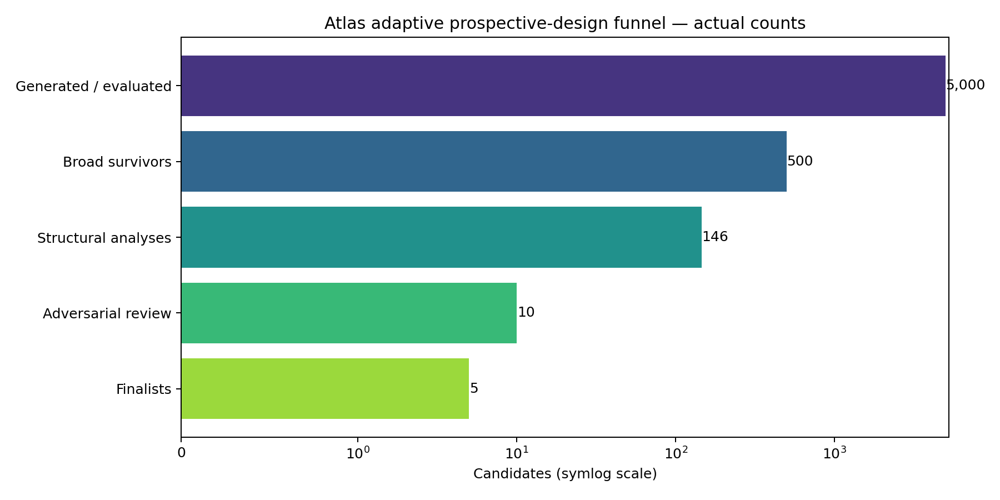

# Atlas

Atlas is a computational protein-engineering pipeline for turning structural
evidence into a ranked, experiment-ready shortlist. Its completed campaign
screened 5,000 DP622-inspired metalloprotease variants and prioritized five
candidates for Aβ-related wet-lab evaluation.

**EXPERIMENTALLY UNTESTED:** these are computationally prioritized hypotheses,
not validated improvements in Aβ cleavage.

**Project status:** v1 campaign complete; wet-lab validation is outside the
scope of this repository.

**Relevant roles:** computational biology · protein engineering · scientific
software · research engineering · ML infrastructure

## My role

I designed and implemented the evidence-aware pipeline, constrained candidate
generation, provenance tracking, validation gates, finalist reporting, and
reproducible GPU/Colab execution path.

## Result

The completed campaign executed this funnel:

```text
5,000 unique legal variants → 500 broad survivors → 146 structure-level analyses
→ 10 adversarially reviewed candidates → 5 finalists
```

| Candidate | Mutations | Design rationale | Supporting evidence | Key uncertainty | Files |
| --- | --- | --- | --- | --- | --- |
| [ATLAS-0215A1AE2C58FD57](results/gate3/dossiers/ATLAS-0215A1AE2C58FD57.md) | G65M/Q153M | Function-oriented change paired with distal support | Independent stability, structure, and interface support | Epistatic double; wet-lab behavior unknown | [FASTA](results/gate3/fastas/ATLAS-0215A1AE2C58FD57.fasta) · [PDB](results/gate3/structures/ATLAS-0215A1AE2C58FD57.pdb) |
| [ATLAS-1FB316267B702519](results/gate3/dossiers/ATLAS-1FB316267B702519.md) | A16C/Q153C | Orthogonal-mechanism epistatic double | Preserved structure/interface support | Cysteine liability is soft; wet-lab behavior unknown | [FASTA](results/gate3/fastas/ATLAS-1FB316267B702519.fasta) · [PDB](results/gate3/structures/ATLAS-1FB316267B702519.pdb) |
| [ATLAS-2EB17A2E3DB7062E](results/gate3/dossiers/ATLAS-2EB17A2E3DB7062E.md) | A130L | Conservative distal-stability explorer | Stability with preserved required support | Expression, folding, and activity unknown | [FASTA](results/gate3/fastas/ATLAS-2EB17A2E3DB7062E.fasta) · [PDB](results/gate3/structures/ATLAS-2EB17A2E3DB7062E.pdb) |
| [ATLAS-39F921440EC002E5](results/gate3/dossiers/ATLAS-39F921440EC002E5.md) | E104V | Second-shell preorganization explorer | Preserved structure/interface support | Charge-class warning; wet-lab behavior unknown | [FASTA](results/gate3/fastas/ATLAS-39F921440EC002E5.fasta) · [PDB](results/gate3/structures/ATLAS-39F921440EC002E5.pdb) |
| [ATLAS-66C6BB6CAA1C310A](results/gate3/dossiers/ATLAS-66C6BB6CAA1C310A.md) | A37Y | Substrate-interface explorer | Strongest retained interface support | Static support does not establish cleavage | [FASTA](results/gate3/fastas/ATLAS-66C6BB6CAA1C310A.fasta) · [PDB](results/gate3/structures/ATLAS-66C6BB6CAA1C310A.pdb) |

See the [finalist summary](results/gate3/FINALIST_SUMMARY.md) and [final design report](results/gate3/atlas_final_design_report.md) for the artifact-backed result.



*The campaign narrows a constrained variant library through independent evidence
and review stages. The finalists are hypotheses for experiments, not validated
therapeutic improvements.*

## The problem

The project tackles a VITA-inspired design problem: optimize a metalloprotease
scaffold for Aβ-related cleavage while keeping structural plausibility, stability,
interface support, and developability visible. The result is a traceable shortlist
with the evidence and uncertainty behind each candidate.

Here, **Aβ** refers to amyloid beta, and **DP622** is the metalloprotease
scaffold used as the design target. An **active-like reconstruction** is a
structure inferred from available structural evidence; it is not presented as a
direct experimental structure of the exact assay construct.

## How Atlas works

```text
Published structural evidence → active-like reconstruction → constrained variant generation
→ stability screening → structure construction / relaxation → catalytic + Aβ-interface analysis
→ liability / developability checks → adversarial review → frozen finalist portfolio
```

The pipeline keeps stability, structure, geometry, interface, and developability
evidence separate before combining them into a ranked shortlist. Each candidate
retains the evidence and limitations behind its selection, so the final result is
auditable rather than a single unexplained score.

## Architecture

The production path is centered on `adaptive_pipeline.py`, with mechanism-aware
design in `design/`, evidence-aware screening and critic logic in `adaptive/`,
candidate-specific structure and geometry analysis in `structure/` and
`geometry/`, late-stage checks in `late_stage/`, and artifact exports in
`reporting/`. It uses Python, BioPython, OpenMM, ThermoMPNN, ThermoMPNN-D, and
a typed orchestration/state system. The [Colab notebook](notebooks/Atlas_DP622_Colab.ipynb)
is the GPU execution entry point with pinned model revisions.

## Scientific integrity and limitations

- The starting model is the 23WN-derived `active_like_inferred` reconstruction,
  not an experimentally observed exact active DP622-S2 complex.
- The exact active DP622-S2 assay construct was not publicly recovered.
- ThermoMPNN and ThermoMPNN-D provide stability evidence, not activity predictions.
- Static geometry and interface preservation do not prove cleavage.
- Replicated MD was excluded from candidate discrimination after reference-validation failure.
- All five finalists require expression/folding, cleavage, kinetics, selectivity,
  and Zn-dependence wet-lab validation.

## Explore and reproduce

For a fast technical review:

1. Read this README for the problem, result, and claim boundaries.
2. Open the [finalist summary](results/gate3/FINALIST_SUMMARY.md).
3. Inspect one [candidate dossier](results/gate3/dossiers/ATLAS-66C6BB6CAA1C310A.md)
   and its linked structure.
4. Run `python -m pytest -q` for the local verification suite.
5. Open the [Colab notebook](notebooks/Atlas_DP622_Colab.ipynb) for the full GPU path.

- [Finalists and funnel](results/gate3/FINALIST_SUMMARY.md)
- [Final design report](results/gate3/atlas_final_design_report.md)
- [Combined FASTA](results/gate3/fastas/finalists.fasta)
- [Reproducibility manifest](results/gate3/reproducibility_manifest.json)
- [Completion audit](results/gate3/completion_audit.json)
- [Limitations report](results/gate3/limitations_report.md)
- [Reproduction guide](docs/reproduction.md)

For a quick review, start with the finalist summary and one dossier/PDB pair.
For code verification, run `python -m pytest -q`. Full execution follows the
pinned GPU Colab path in the reproduction guide.

## Engineering highlights

- Typed pipeline orchestration with checkpointed runs and resumable stages.
- Constrained variant generation across single and epistatic mutations.
- Independent stability, geometry, interface, and developability evidence.
- Provenance records that preserve model revisions, inputs, and claim boundaries.
- Explicit failure handling and candidate dossiers designed for review.

## License

Atlas is released under the [MIT License](LICENSE). Third-party dependencies,
models, datasets, structures, papers, and reference materials remain subject to
their own licenses and terms.

## References

- [VITA: Aβ-related metalloprotease reference](references/vita_abeta_metalloprotease.pdf)
- [23WN structure metadata](references/structures/EMD-69322_metadata.json)
- [ThermoMPNN](https://github.com/Kuhlman-Lab/ThermoMPNN)
- [ThermoMPNN-D](https://github.com/Kuhlman-Lab/ThermoMPNN-D)
- [OpenMM](https://openmm.org/)
- [LangGraph](https://github.com/langchain-ai/langgraph)

## Documentation map

- [Reproduction guide](docs/reproduction.md) — local checks and the full GPU path.
- [Scientific decisions](docs/scientific_decisions.md) — modeling choices and evidence boundaries.
- [Limitations](docs/limitations.md) — known technical and scientific constraints.
- [Final design report](results/gate3/atlas_final_design_report.md) — campaign narrative and final portfolio.
- [Benchmark analysis](docs/benchmark_failure_analysis.md) — validation findings and how they changed the workflow.
